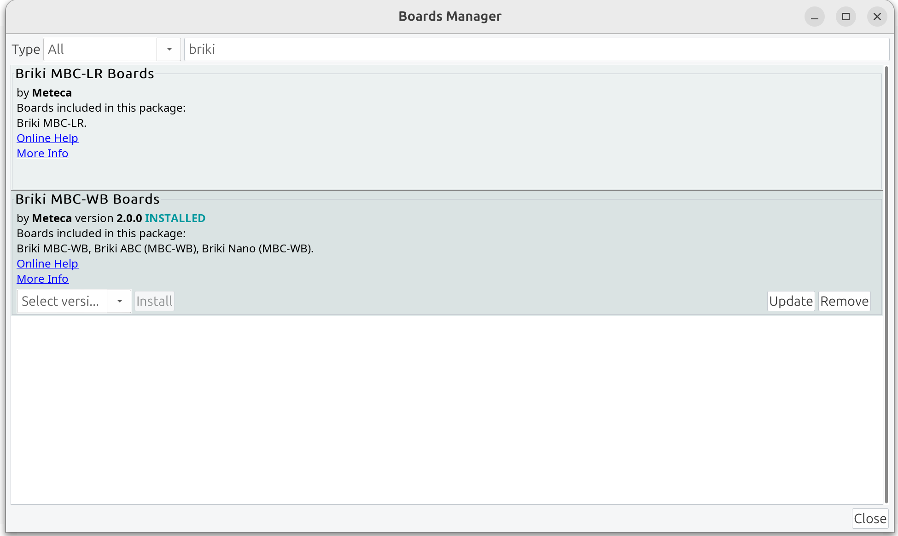
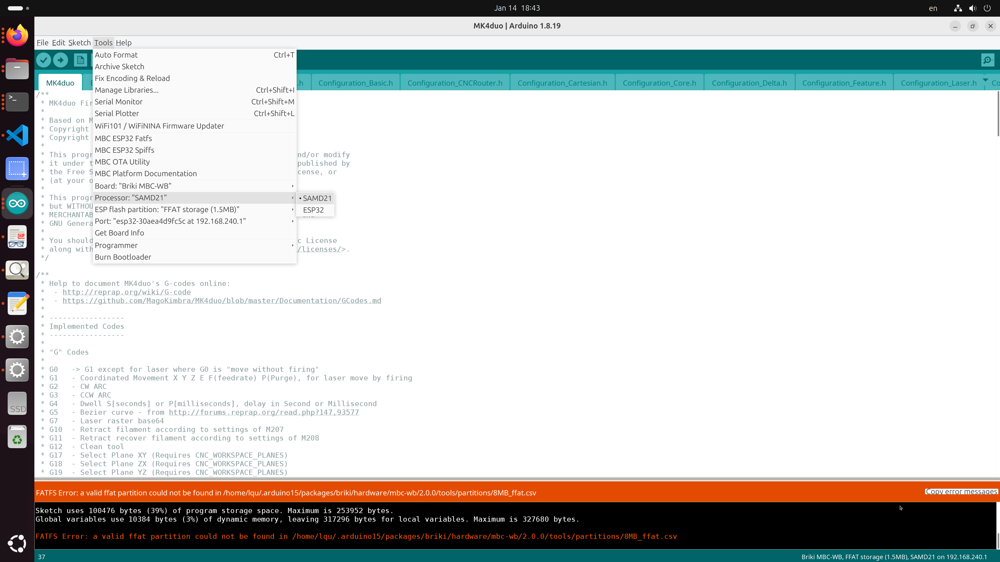
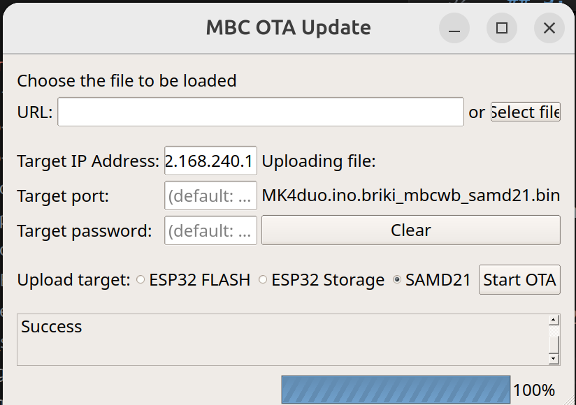
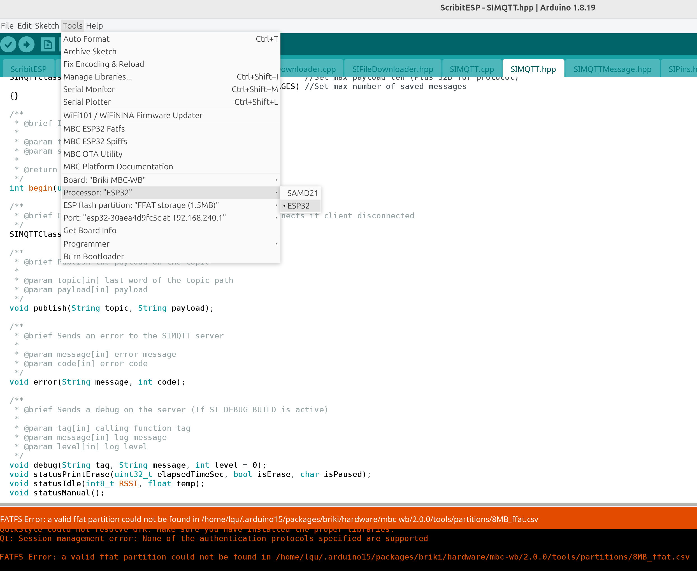

# Introduction
This file describes the process to program open source firmware onto Scribit - the wall drawing robot.


Scribit is a wonderful and successful crowd-sourced project, but its support ended. The iPhone App stopped working as the backend cloud service is no longer available. That's why we need the open source firmware to replace the stock firmware, so that we can use it standalone without relying a remote service that doesn't exist anymore.

The programming is purely over-the-air (OTA), and there is no need to open the case or connect cables to USB or Serial Port.

# Procedure
## 1. Verify Preconditions
Assuming your Scribit is running stock firmware, when powered on its LED should glow BLUE for 2 seconds, then fast blinks WHITE continuously (5 Hz). 

Your PC should also see a Wi-Fi access point called Scribit-xxxxxx, where xxxxxx is the 2nd half of its MAC address. Connect to the AP using the default password (The default Wi-Fi password is publicly documented and can be found online.). After connection, your PC should have DHCP IP address like 192.168.240.2, and the Scribit has 192.168.240.1

Stock Scribit firmware has a web server running at TCP port 8888, allowing you to set up the unit to join your home Wi-Fi network. Test with curl, and you should see following responses.


```
$ curl http://192.168.240.1:8888
{ "Error":" No body", "code":"30aea4xxxxxx"}

$ curl -H "Content-Type: application/json" -d '{"ssid":"myHomeRouter"}' http://192.168.240.1:8888
{ "Error":" pwd missing", "code":"30aea4xxxxxx"}
```

Now give it the password and make real changes.

```
$ curl -H "Content-Type: application/json" -d '{"ssid":"myssid", "password":"mypasswd"}' http://192.168.240.1:8888
{ "code":"30aea4xxxxxx"}

```

After this, the Scribit will connect to your home network. Its LED will turn GREEN, then breathe slowly WHITE.

At this point (still running **stock firmware**), the device exposes a new access point named:

    MBC-WB-xxxxxx

This AP is provided by the ESP32 OTA task and exists **before** installing the open-source firmware.
It does not require a password and uses IP address 192.168.240.1.
This is the access point used for all OTA firmware updates.


## 2. Install Arduino IDE
Download Arduino IDE version 1.8.19. The latest version 2.3.7 doesn't work well as of 2025/12.

In "File -> Preferences -> Settings -> Additional Boards Manager URL", add following URL and click 'OK'.

```
https://www.briki.org/download/resources/package_briki_index.json
```


Then go to "Tools -> Board:... -> Boards Manager ... ->", filter by 'briki', and install 'Briki MBC-WB Boards'. Version 2.0.0 works best. 2.1.7 gave me problems.



## 3. Clone and Copy Files
Check out from github and follow official instructions.

```
git clone https://github.com/scribit-open/open-firmware

cd open-firmware

cp ExtraFile/SIConfig.hpp.example Firmware/ScribitESP/SIConfig.hpp
cp ExtraFile/Mk4duoVersion.h.example Firmware/MK4duo/Mk4duoVersion.h
cp ExtraFile/ScribitVersion.hpp.example Firmware/ScribitESP/ScribitVersion.hpp
```

Depending on where you Arduino libraries are installed, copy files to the SDK. Followig works for me on Ubuntu 24.04.

```
cp ExtraFile/8MB_ffat.csv $HOME/.arduino15/packages/briki/hardware/mbc-wb/2.0.0/tools/partitions/
cp ExtraFile/8MB_spiffs.csv $HOME/.arduino15/packages/briki/hardware/mbc-wb/2.0.0/tools/partitions/
cp ExtraFile/SERCOM.cpp $HOME/.arduino15/packages/briki/hardware/mbc-wb/2.0.0/cores/samd21/

cp -r ExtraFile/arduino-mqtt $HOME/.arduino15/packages/briki/hardware/mbc-wb/2.0.0/libraries/
cp -r ExtraFile/StepperDriver $HOME/.arduino15/packages/briki/hardware/mbc-wb/2.0.0/libraries/
```

## 4. Compile and OTA Update
There are 2 projects in open-firmware, for ESP32 and SAMD21 chips respectively. Open both of them in Arduino IDE in separate windows.

### 4.1 MK4duo (SAMD21)
Open `Firmware/MK4duo/MK4duo.ino` in Arduino IDE, compile, and "Sketch -> Export compiled Binary". Make sure the processor is `SAMD21`.



Open "Tools -> MBC OTA Utility" and upload the exported binary to Scribit's SAMD21 chip at 192.168.240.1

File name `Firmware/MK4duo/MK4duo.ino.briki_mbcwb_samd21.bin`



### 4.2 ScribitESP (ESP32)
Open `Firmware/ScribitESP/ScribitESP.ino` in Arduino IDE. If you want to avoid complicated Certificate Authority settings, make the following change to disable it temporarily.

⚠️ WARNING: TLS Disabled

The following change disables MQTT TLS and certificate verification.
This is intended for local testing only.
Do NOT use on untrusted networks.

```
$ git diff
diff --git a/Firmware/ScribitESP/SIMQTT.cpp b/Firmware/ScribitESP/SIMQTT.cpp
index 4a4be74..9dff92b 100644
--- a/Firmware/ScribitESP/SIMQTT.cpp
+++ b/Firmware/ScribitESP/SIMQTT.cpp
@@ -43,7 +43,6 @@ int SIMQTTClass::begin(uint8_t t_ID[6], bool skip)
         m_ID[i] = t_ID[i];
 
     //Set certificate
-    net.setCACert(ca_cert);
     client.begin(SI_MQTT_HOST, SI_MQTT_PORT, net);
     bool status = connect();
     m_initialized = true;
diff --git a/Firmware/ScribitESP/SIMQTT.hpp b/Firmware/ScribitESP/SIMQTT.hpp
index 834439f..1baa344 100644
--- a/Firmware/ScribitESP/SIMQTT.hpp
+++ b/Firmware/ScribitESP/SIMQTT.hpp
@@ -1,7 +1,8 @@
 #pragma once
 
 #include <MQTT.h>
-#include <WiFiClientSecure.h>
+#include <WiFi.h>
+#include <WiFiClient.h>
 #include "SIConfig.hpp"
 #include "AxxxLib/CircBuf.h"
 #include "SIMQTTMessage.hpp"
@@ -50,7 +51,7 @@ enum SIMQTT_ERRORS
 class SIMQTTClass
 {
 
-  WiFiClientSecure net;
+  WiFiClient net;
   MQTTClient client;
 
   MQTTClientCallbackSimple m_cb; //Callback function
```
And make the following edit to `Firmware/ScribitESP/SIConfig.hpp`

```
const char SI_MQTT_USER[] = "scribit";              //MQTT user
const char SI_MQTT_PASS[] = "scribit";              //MQTT password
const unsigned long SI_MQTT_PORT = 1883;            //MQTT port
const char SI_MQTT_HOST[] = "192.168.240.2";        //MQTT host            
```

Make sure the processor is ESP32, compile, and export binary.



Open "Tools -> MBC OTA Utility" and upload the exported binary to Scribit's ESP32 chip at 192.168.240.1

File name `Firmware/ScribitESP/ScribitESP.ino.briki_mbcwb_esp32.bin`

### 4.3 Upload ESP32 Storage
Open "Tools -> MBC OTA Utility" and upload the storage binary to Scribit's ESP32 chip at 192.168.240.1. Find the file in `/tmp/arduino_build_xxxxxx`

File name `/tmp/arduino_build_814948/ScribitESP.ino.partitions.bin`

## 5. Verification
According to the settings in `Firmware/ScribitESP/SIConfig.hpp`, the robot expects an MQTT server at `192.168.240.2`. Usually your PC gets that IP address. If that's not the case, and you get `192.168.240.3`, set up an alias IP.

```
sudo ip addr add 192.168.240.2/24 dev wlp5s0
```

Now set up an MQTT server and configure user/pass `scribit:scribit`. (Details are omitted to keep focus. Ask your favorite LLM if needed.)

Watch MQTT log, and you should see the robot connecting and publish status.
```
journalctl -u mosquitto -f &

Jan 14 19:56:35 myUbuntu2404 mosquitto[1692]: 1768449395: Received PUBLISH from ScribIt-d9fc5c (d0, q0, r0, m0, 'tout/30aea4d9fc5c/boot', ... (42 bytes))
Jan 14 19:56:38 myUbuntu2404 mosquitto[1692]: 1768449398: Received PUBLISH from ScribIt-d9fc5c (d0, q0, r0, m0, 'tout/30aea4d9fc5c/boot', ... (42 bytes))
Jan 14 19:56:41 myUbuntu2404 mosquitto[1692]: 1768449401: Received PUBLISH from ScribIt-d9fc5c (d0, q0, r0, m0, 'tout/30aea4d9fc5c/boot', ... (42 bytes))
Jan 14 19:56:44 myUbuntu2404 mosquitto[1692]: 1768449404: Received PUBLISH from ScribIt-d9fc5c (d0, q0, r0, m0, 'tout/30aea4d9fc5c/boot', ... (42 bytes))
```

At this point, the open firmware is programmed successfully! Hooray!

